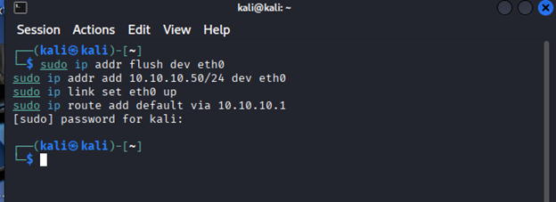
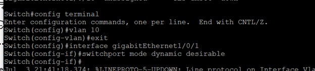
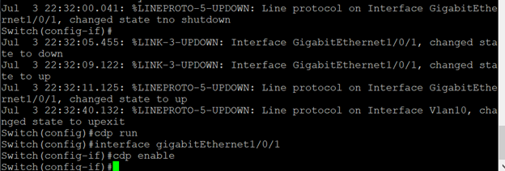
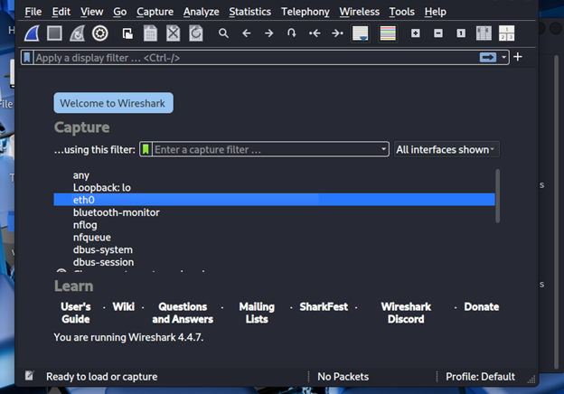
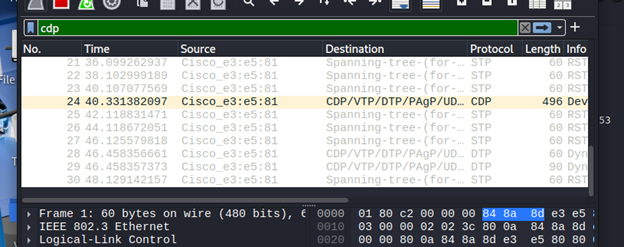
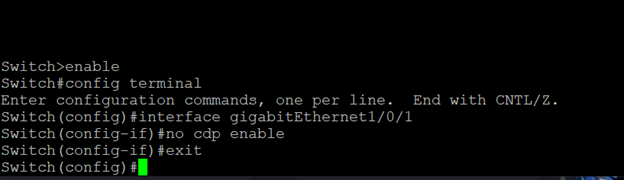
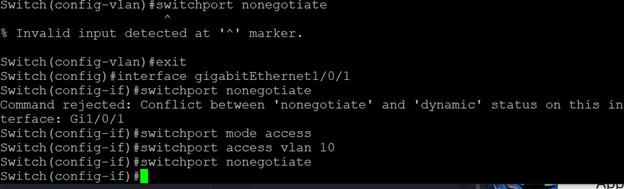
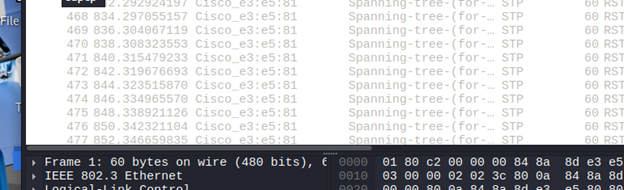

# 2. Layer 2 Reconaissance

## Objective
Analyze how inproper use of protocols can be observed by an attacker through packet captures and used to conive avenues to break into a network and compromise it's systems.

## Set up

A Kali linux VM was configured with the following:

It the L3 switch was set up with the insecure Dynamic Trunking Protocol (DTP) and CDP (Cisco Discovery Protocol)

DTP can allow an attacker to negotiate the creation of trunk ports, meaning it will carry traffic of multiple VLANs, allowing an attacker to potentially send traffic to unauthorized ports for the VLAN (VLAN Hopping). CDP can aid an attacker because it gives out information on a switch (hostname, model, neighbor devices) that an attacker can use to map a network or look for vulnerabilities.

The attacker machine will now use Wireshark to gain network traffic packets to exploit the traffic.

These capture packets show CDP and DTP traffic. An attacker can conclude that DTP is in use and attempt VLAN Trunking attacks on the network, and with CDP they can probe and get valuable information on a network's structure.

To remove these vulnerabilities, CDP and DTP will be disabled.

Now, Wireshark captures have no CDP or DTP Traffic.

