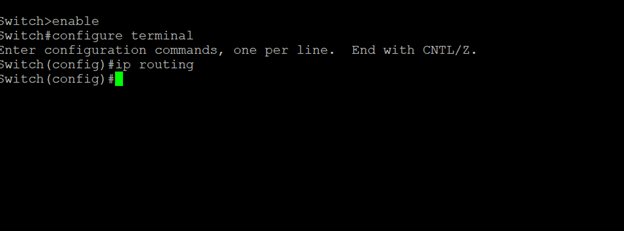

# Switch Setup
## VLAN Creation

The following screenshot shows the VLAN configuration on the Layer 3 switch aftering entering:
  
enable
configure terminal

IP Routing is enabled to allow the L3 Switch to act as a router.
VLAN overview:

Then the SVIs must be created and configured to prevent outside traffic.

.png)
.png)

An overview of all the interfaces:

# Connectivity Test

First the changes to the machine settings:

(PC 2 is set to 10.10.10.11)
Then a ping test. I set VLAN 10 to use both Port 6 and 1 to see if devices in the same VLAN can communicate with each other.

-VLAN-Connectivity-Test.png)

From Machine 2 -> 1:

VLAN-Connectivity-Test-(2).png)

Then I set device 2 into another VLAN (VLAN 30) to test if communication still works.
Device 2 is now connected to port 3 with an IP of 10.10.30.10, testing connectivity both ways.

Device 2 can ping its SVI (10.10.30.1) but not VLAN 10's (10.10.10.1) or Device 1 (10.10.10.10)

