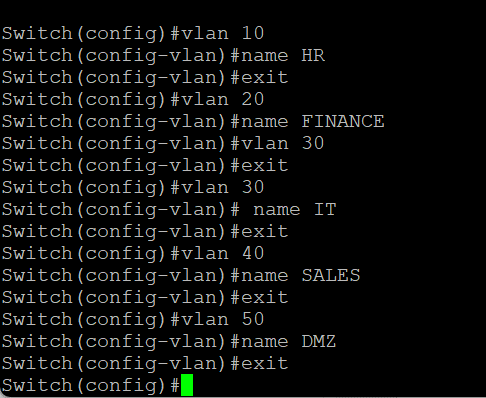
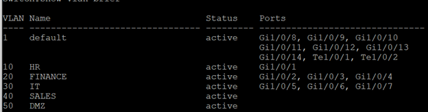
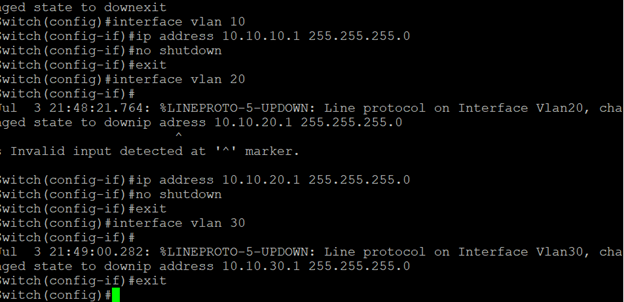
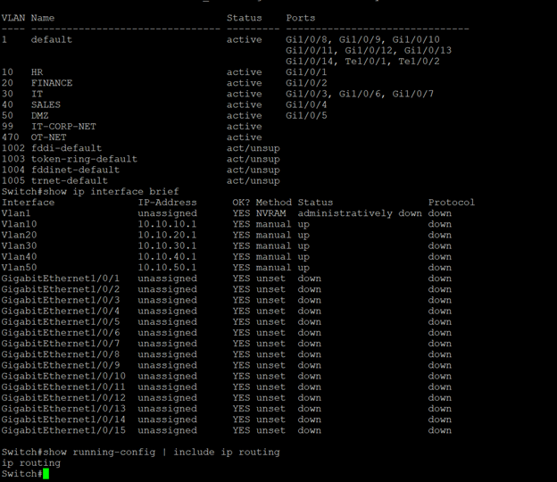
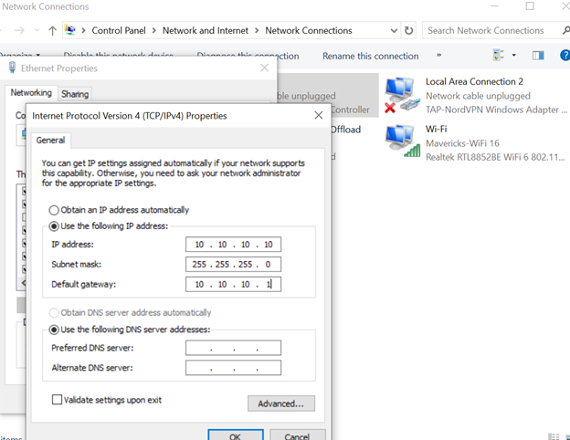
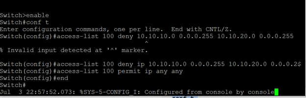
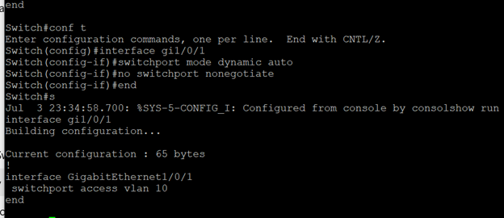

## VLAN Creation

The following screenshot shows the VLAN configuration on the Layer 3 switch aftering entering:
  
enable
configure terminal

IP Routing is enabled to allow the L3 Switch to act as a router.
VLAN overview:

Then the SVIs must be created and configured to prevent outside traffic.

.png)
.png)

An overview of all the interfaces:

# Connectivity Test

First the changes to the machine settings:

(PC 2 is set to 10.10.10.11)
Then a ping test. I set VLAN 10 to use both Port 6 and 1 to see if devices in the same VLAN can communicate with each other.

-VLAN-Connectivity-Test.png)

From Machine 2 -> 1:

VLAN-Connectivity-Test-(2).png)

Then I set device 2 into another VLAN (VLAN 30) to test if communication still works.
Device 2 is now connected to port 3 with an IP of 10.10.30.10, testing connectivity both ways.

Device 2 can ping its SVI (10.10.30.1) but not VLAN 10's (10.10.10.1) or Device 1 (10.10.10.10)

-VLAN-Connectivity-Test.png)

Vice versa for Device 1.

-VLAN-Connectivity-Test-(2).png)

# Attack Simulation

In a Kali Linux VM, the follow commands were run for the target system:
- sudo ip addr flush dev eth0 (clears all old configs for interface)
- sudo ip addr add 10.10.10.50/24 dev eth0 (Assigns IP to device to eth0)
- sudo ip link set eth0 up (Turns interface eth0 on)
- sudo ip route add default via 10.10.10.1 dev eth0 (establishes 10.10.10.1 as the gateway)

Then tested for connectivity to the gateway

.png))

Success.

Next, setting up the attacker system:
- sudo ip addr flush dev eth0
- sudo ip addr add 10.10.20.50/24 dev eth0
- sudo ip link set eth0 up
- sudo ip route add default via 10.10.20.1 dev eth0

Also a successful connection to the gateway.

.png))

Now the Attacker Machine (VLAN 10) will try to communicate with the Target Machine (VLAN 20).

S.png))

It was a success. This should not happen and is a security issue.

To mitigate this, we will apply an ACL to prevent routing from VLAN 10 to VLAN 20:

)

Then apply it to VLAN 10.

.png))

After ACL implementation, the attacker can no longer reach the target.

F.png))

# VLAN Hopping Preventation

The following are settings that an insecure network will have:

)

Dynamic Trunk Protocol (DTP) is enabled, which means that an attacker can negotiate trunk ports and give them access to communicate with other VLANs.

To prevent this, we 1. disable autonegotiate mode and 2. set the port to access mode only:

.png))

This prevents a common attacks vector for VLAN Hopping Attacks that can compromise a network.

